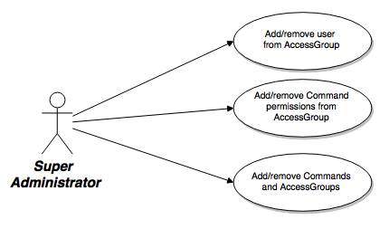
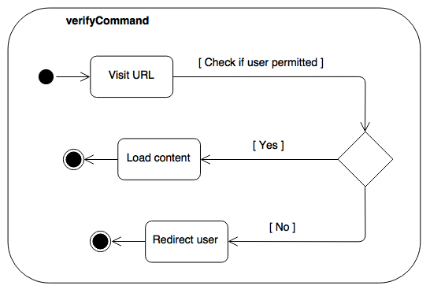

# RBAC


<hr>
### Setup
1. Setup LAMP environment
2. Create php/databaseConfig.php with your MySQL credentials as follows
```
<?php
return array(
  'user' => '',
  'pass' => '',
  'name' => 'store3.3',
  'host' => '127.0.0.1'
);
?>
```
3. Run db/create.sql then db/insert.sql
4. Place comp344-src/ in `wherever`/
5. If production: Change httpd.conf DocumentRoot to `wherever`/comp344-src/public/
6. Run server


<hr>
### To Do
- Add/remove Users/Shoppers from AccessGroups
- Functionality: Command table with add/remove
- Functionality: AccessGroup table with add/remove
- Figure out commands and integration
- LOGGING?
- webpack min js


<hr>
### Done
- Auth/RBAC


<hr>
### Known Bugs
- None (uh oh)


<hr>
### UML






<hr>
### Database Schema (v.3.3)
<br>


<hr>
### Commands
| Role Name  | Command | URL |
| ---------- | ------- | --- |
| Guest | Display Category | DisplayCategory.php |
|       | Display Products | DisplayProducts.php |
|       | Display Product | DisplayProduct.php |
| Registered Shopper  | Pay? | Pay? |
| Super Administrator | Administrate Users        | AdminUsers.php        |
|                     | Administrate AccessGroups | AdminAccessGroups.php |
|                     | Administrate Commands     | AdminCommands.php     |
| Catalogue Manager | Add Category | AddCategory.php |
|                   | Add Product  | AddProduct.php  |
| Warehouse Staff | Display Pick List | DisplayPickList.php |
| Customer Service Manager | |  |
| Manager | |  |
