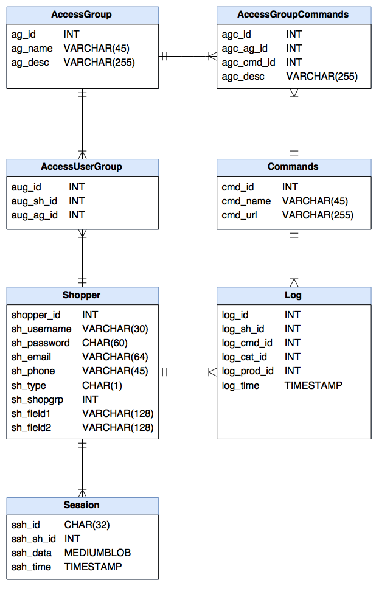

## COMP344 - Ecommerce
### A2 Stage 1 Draft
 

### Sub-Schema

#### Description
| Table                | Description                                        |
| -------------------- | -------------------------------------------------- |
| `Shopper`            | Represents a registered user                       |
| `AccessGroup`        | AKA Role, it represents a named set of permissions |
| `AccessUserGroup`    | Assigns `Shopper`s to `AccessGroup`s               |
| `Command`            | List of commands and their relevant URLs           |
| `AccessGroupCommand` | Assigns `Command` permission to `AccessGroup`s     |
| `Log`                | Records `Shopper`s interactions with the system    |
| `Session`            | `Shopper` login session                            |
 

| `Shopper`     | Description       |
| ------------- | ----------------- |
| shopper_id    | Primary key       |
| sh_username   | Username          |
| sh_password   | Bcrypted password |
| sh_email      | Email address     |
| sh_type       | ????              |
| sh_shopgrp    | `ShopperGroup` foreign key |
| sh_field1     | Auxiliary field 1 |
| sh_field2     | Auxiliary field 2 |

| `AccessGroup` | Description         |
| ------------- | ------------------- |
| ag_id         | Primary key         |
| ag_name       | Name of role        |
| ag_desc       | Description of role |

| `AccessUserGroup`  | Description               |
| ------------------ | ------------------------- |
| aug_id             | Primary key               |
| aug_sh_id          | `Shopper` foreign key     |
| aug_ag_id          | `AccessGroup` foreign key |

| `AccessGroupCommand` | Description               |
| -------------------- | ------------------------- |
| agc_id               | Primary key               |
| agc_ag_id            | `AccessGroup` foreign key |
| agc_cmd_id           | `Command` foreign key     |
| agc_desc             | Description of why/how an `AccessGroup` uses this `Command` |

| `Command` | Description     |
| --------- | --------------- |
| cmd_id    | Primary key     |
| cmd_name  | Name of command |
| cmd_url   | URL of command  |

| `Log`         | Description            |
| ------------- | ---------------------- |
| log_id        | Primary key            |
| log_sh_id     | `Shopper` foreign key  |
| log_cmd_id    | `Command` foreign key  |
| log_cat_id    | `Category` foreign key |
| log_prod_id   | `Product` foreign key  |
| log_timestamp | Time command was run   |

| `Session` | Description           |
| --------- | --------------------- |
| ssh_id    | Primary key           |
| ssh_sh_id | `Shopper` foreign key |
| ssh_data  | Stored session data   |
| ssh_time  | Time of last write    |
____________________________________________________________________________________________________

#### ER Diagram
 

____________________________________________________________________________________________________

A guiding principle of design has been to stick to the reference schema where possible,
however the naming conventions were standardised as follows:

- Entities now use *`CamelCase`* naming

- Attributes now use *`low_case_under_score`* naming

- `AccessUserGroup` makes more sense named as `UserAccessGroup`, however it will not be
  changed to avoid any confusion

- Unpluralised `Commands` and `AccessGroupCommands` to `Command` and `AccessGroupCommand`

- `Shopper`:
  sh_id was shopper_id

- `AccessUserGroup`:
  aug_sh_id was aug_shopper_id

- `Log`:
  log_id was id,
  log_sh_id was log_shopper_id,
  log_time was log_timestamp

- `Session`:
  ssh_id was id,
  ssh_sh_id was shopper_id,
  ssh_data was data,
  ssh_time was time

____________________________________________________________________________________________________

Other schema design thoughts:

- Whether to use `INT`s or switch to `GUID`s for key fields is still being decided. At the
  moment `INT` is being used and the database test data code is in SQL so that will
  have to be slightly refactored to accomodate generating GUIDs.

- `AccessGroup` could use a nickname field to allow more flexible UI options, (e.g. small tags
  on user rows to signify their roles), which is not feasible using standard names
  due to their length. Will not be implementing this at this time.

- `VARCHAR` type is used in the ER diagram but this is expected to be implemented as
  `VARCHAR2` on Oracle DBMS.

- Consider renaming `Session` as it is a reserved SQL keyword
____________________________________________________________________________________________________

### Logic

 

